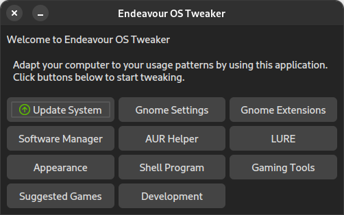
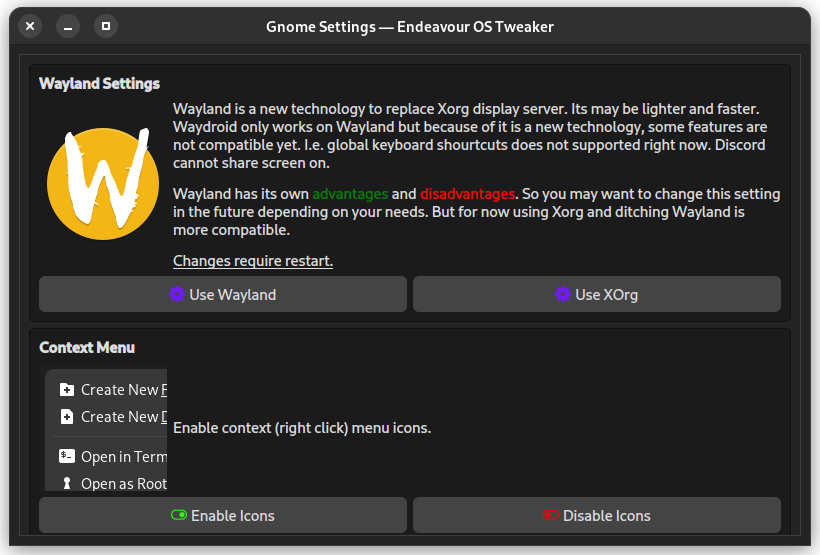
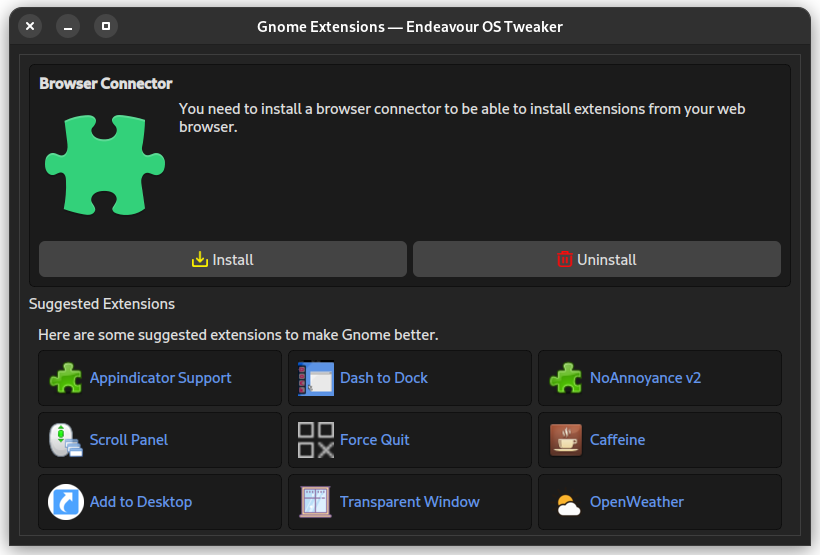
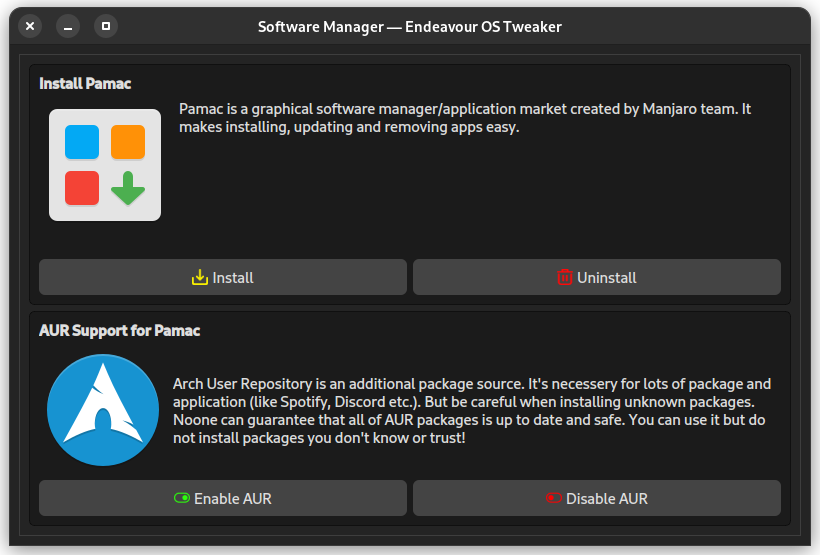
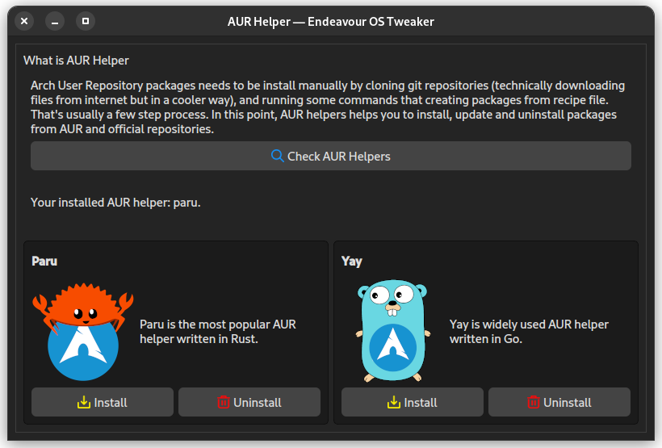
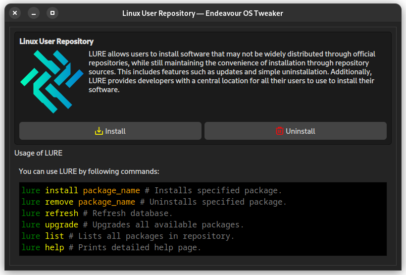
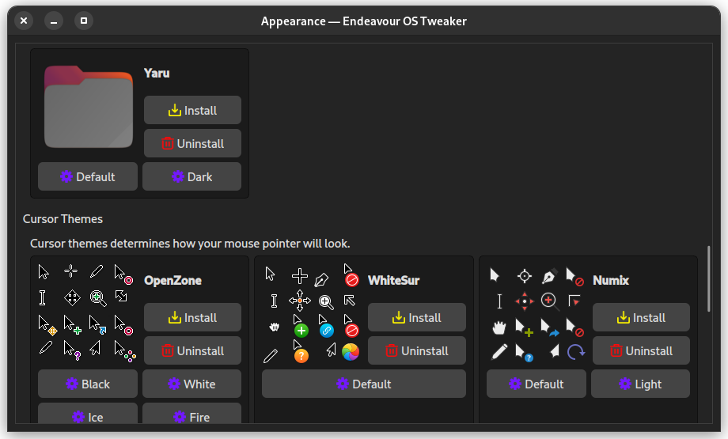
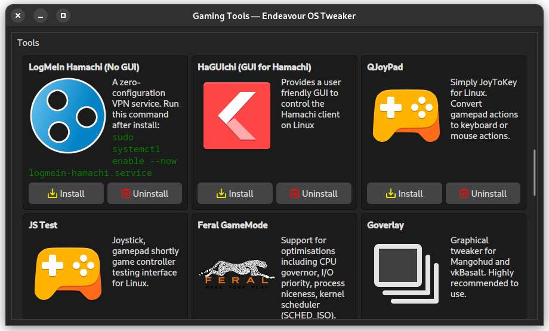
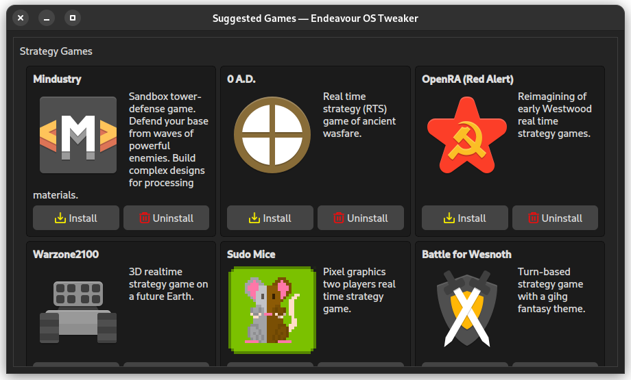
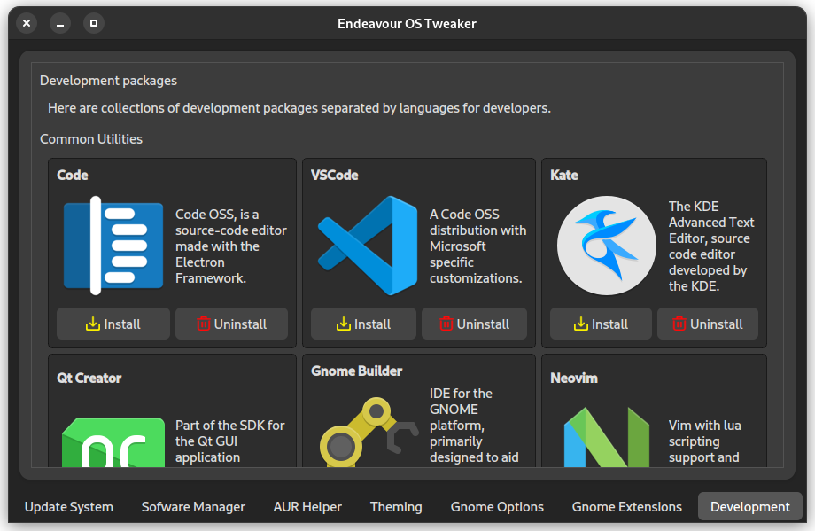

# Make Endeavour OS Great

Endeaours OS is already a great OS. But it describe itself as a *"terminal centric"* distro. Noone can suggest a Arch-based distro to a newcomer. But Arch Linux has a great oppurtunity named AUR. Endeavour OS makes installing Arch easier. So I wanted to make Endeavour OS more suitable for newcomers.

This application mostly targets Gnome DE users. You can always use other options than gnome ones. But my first aim is to make Gnome better for users. In close future, I *may* develop options for other DE or WM users (such as i3).

You may want to take a look at [TODOs](TODOs.md)
and may want to take a look at [Commands](Commands.md).

I'll create a GUI app to make it easier to use for newcomers.

## ScreenShots

