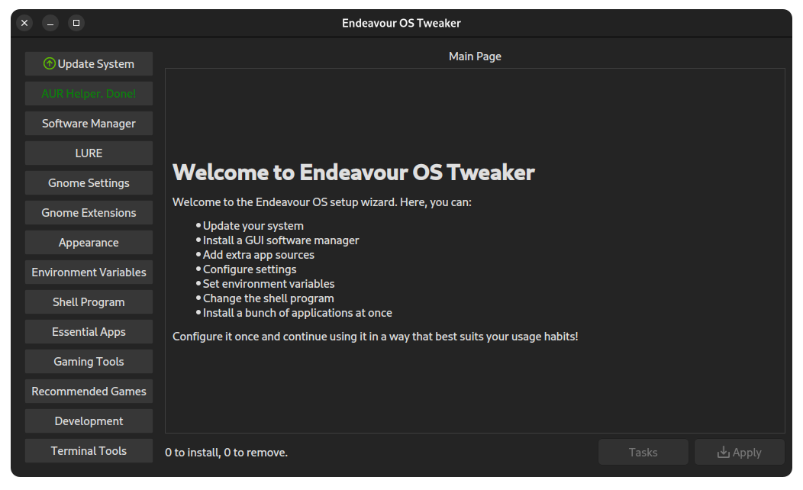
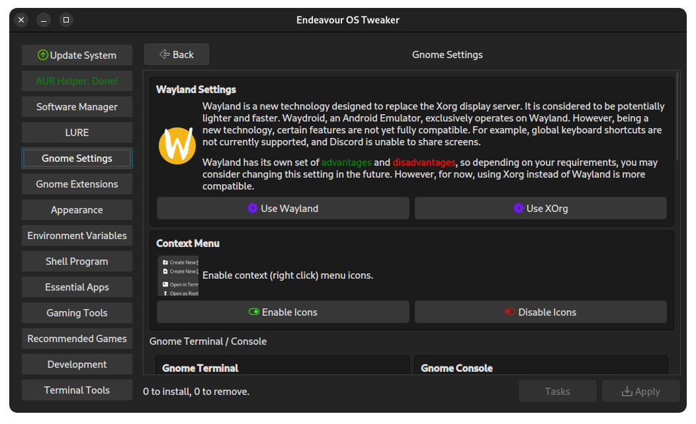
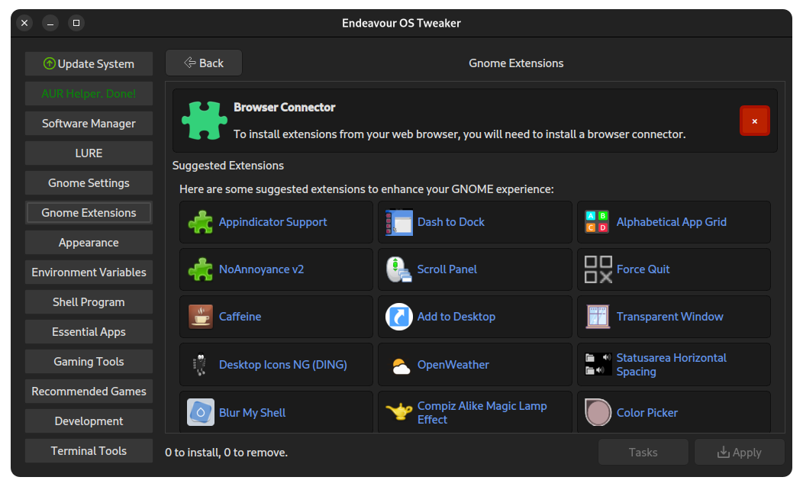
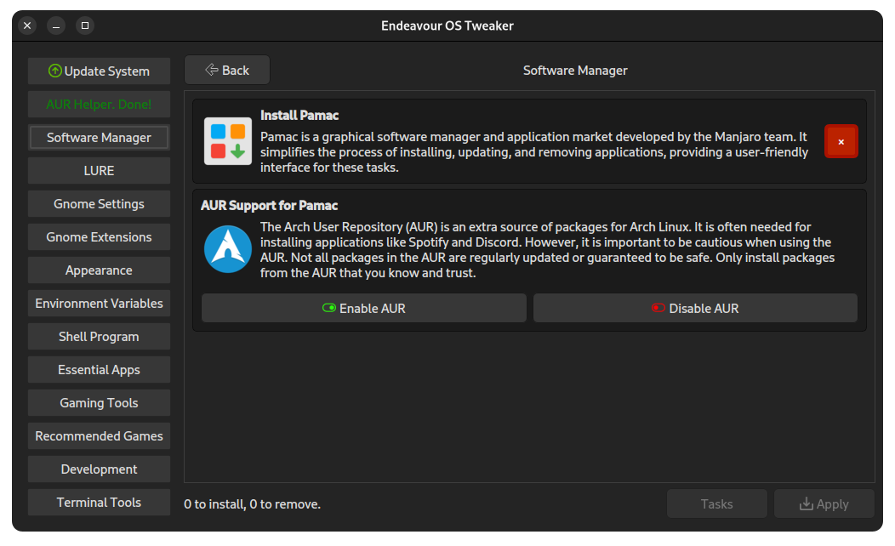
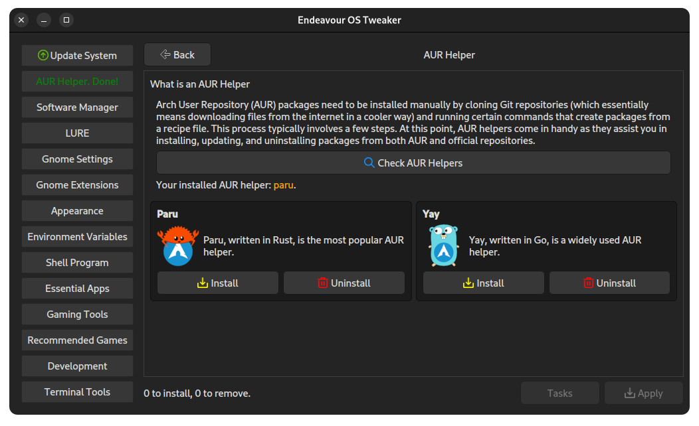
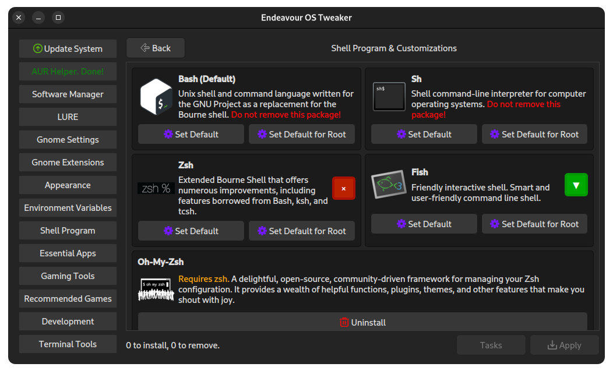
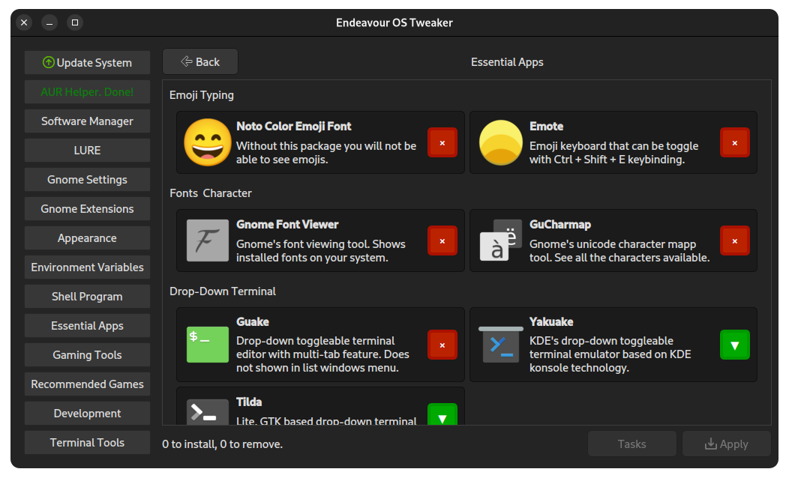
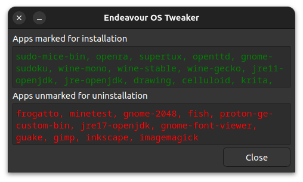

# Make Endeavour OS Great

Endeavour OS is already a great OS, but it describes itself as a "terminal-centric" distro. No one can suggest an Arch-based distro to a newcomer. However, Arch Linux offers a great opportunity called AUR. Endeavour OS makes installing Arch easier, so I wanted to make it more suitable for newcomers.

This application mainly targets GNOME DE users, although you can always choose other options besides GNOME. However, my primary goal is to enhance the GNOME experience for users. In the near future, I *may* develop options for other DE or WM users, such as i3.

## ScreenShots

## Contributors

<!-- readme: contributors -start -->
<table>
<tr>
    <td align="center">
        <a href="https://github.com/Elagoht">
            
             
            <b>Furkan Baytekin</b>
        </a>
    </td>
    <td align="center">
        <a href="https://github.com/gobelman67">
            
             
            <b>Mehmet Burak Oktay</b>
        </a>
    </td></tr>
</table>
<!-- readme: contributors -end -->